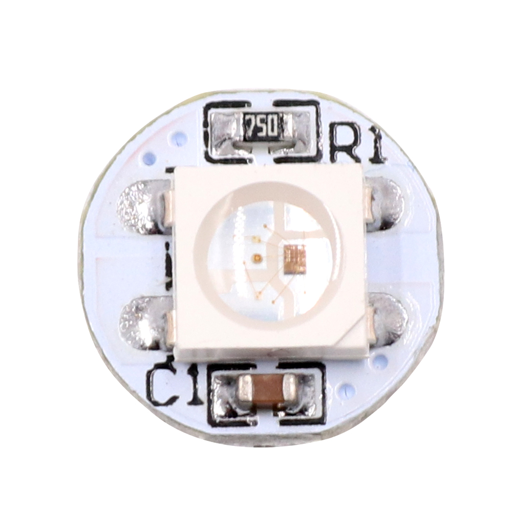
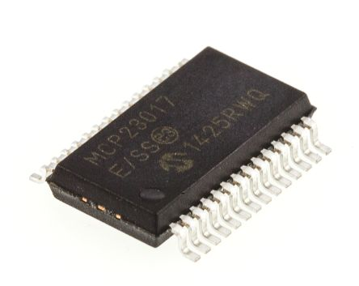
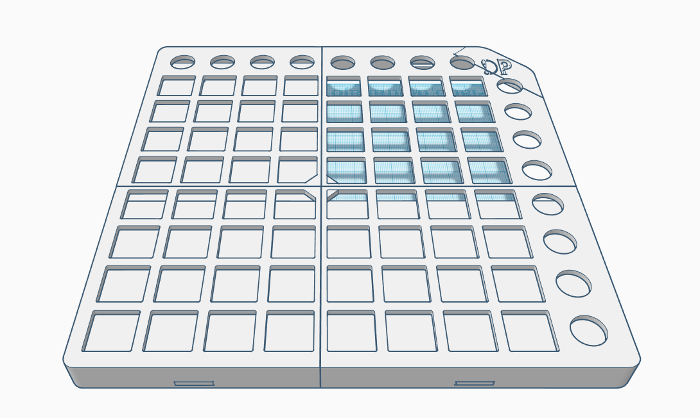
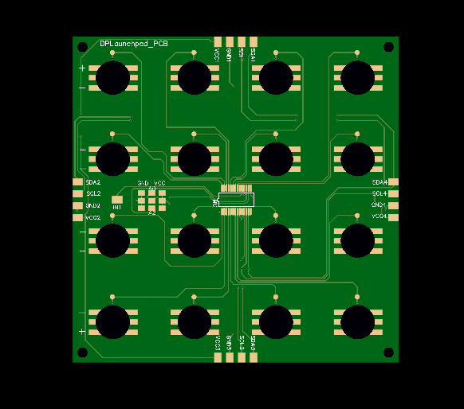
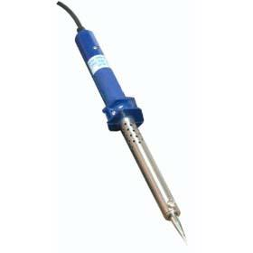
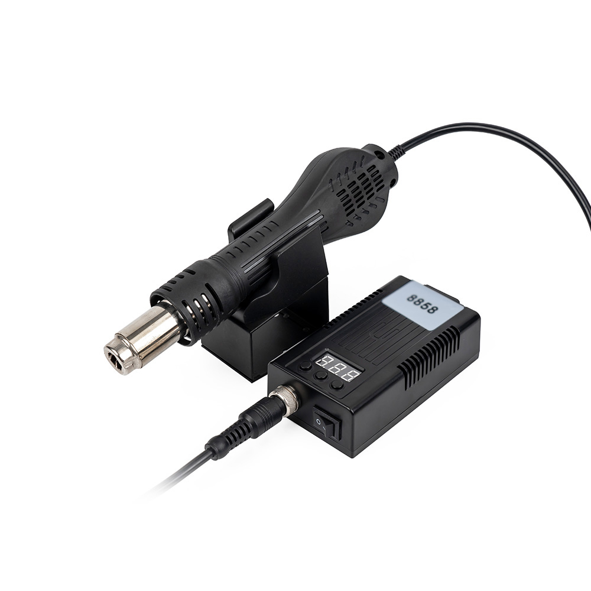
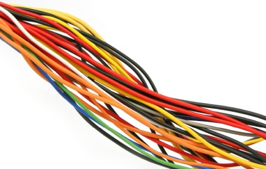
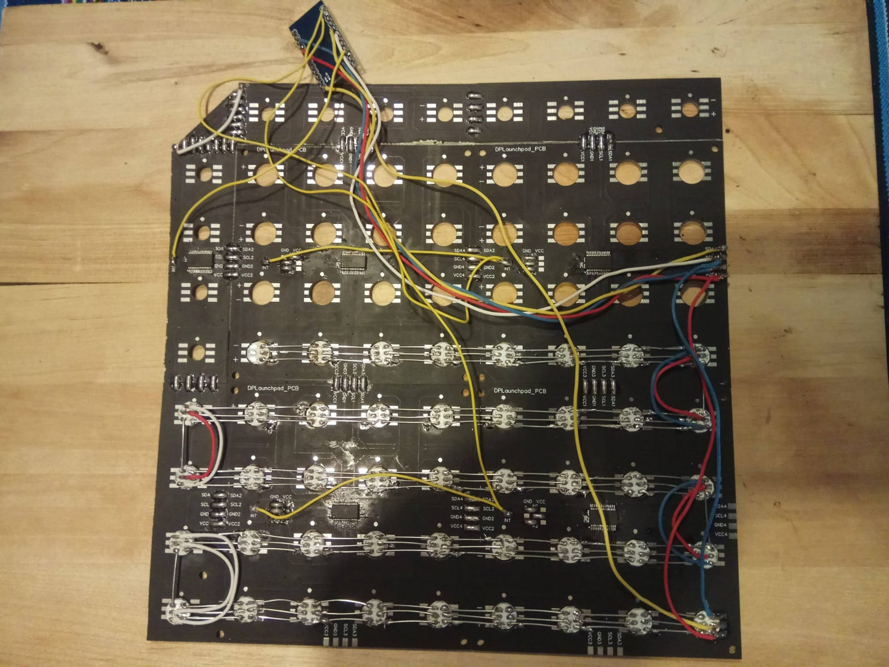

# DIY-Launchpad

## This project is a DIY Launchpad powered by an Arduino, it is compatible with every Music Production program or app which can recognize USB MIDI devices, like Ableton Live.

## Instructions:

1. First you will need to gather all the parts and tools shown below, which are required for this project:

### Parts
|Units| Name|Cost (€)| Image|
|:--:|:------------------:|:-------------------:|:-------------:|
|1|Rubber Pad|20||
|1|Arduino Pro Micro|2.5||
|80|WS2812B RGB LEDs|8||
|5|MCP23017 - E/SS|4||
|1|3D Printed pieces Set|15||
|1|PCB Launchpad Set|10||

### Tools / Materials
|Name|Image|
|:-------------------:|:-------------:|
|Tin Solder||
|Hot Air Gun (Recommended)||
|Tin||
|Wires||

2. Then you will need to solder the MCP23017-E/SO integrated circuits to the PCBs using the Hot Air gun, as well as the PCBs one another connecting their pads, and the WS2812B RGB LEDs with the aid of the Tin Solder and metal wire. Then make the following connections between the Arduino Pro Micro and the PCBs:

|Arduino Pin|PCB Pad|
|:------:|:------:|
|2|SDA|
|3|SCL|
|VCC|VCC|
|GND|GND|

You may also make sure to connect the first WS2812B RGB LED of your array to the Arduino, connecting:

|Arduino Pin|LEDs Pad|
|:------:|:------:|
|VCC|VCC|
|GND|GND|
|10|DATA|

As well as the interrupt pads of the PCBs (grouping them by pairs) as shown:

|Arduino Pin|Interrupt|
|:------:|:------:|
|0|1 and 2|
|1|3 and 4|
|7|5|

The final result should be something like this:

3. Flash the firmware to the Arduino Pro Micro, 3D print the housing, assemble everything and enjoy. :)

### This is still an ongoing project, and many things have to be fixed/improved yet, feel free to comment the project or make any sugestion you think it would make it better!

If you want to know what I am currently working on, visit http://psoetardgarcia.ga/
