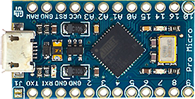

# DIY-Launchpad

## This project is a DIY Launchpad powered by an Arduino, it is compatible with every Music Production program or app which can recognize USB MIDI devices, like Ableton Live.

## Instructions:

1. First you will need to gather all the parts and tools shown below, which are required for this project:

### Parts
|Units| Name|Cost (€)| Image|
|:--:|:------------------:|:-------------------:|:-------------:|
|1|Rubber Pad|20||
|1|Arduino Pro Micro|2.5||
|80|WS2812B RGB LEDs|8||
|5|MCP23017 - E/SS|4||
|1|3D Printed pieces Set|15||
|1|PCB Launchpad Set|10||

### Tools / Materials
|Name|Image|
|:-------------------:|:-------------:|
|Tin Solder||
|Hot Air Gun (Recommended)||
|Tin||
|Wires||

2. Then you will need to solder the MCP23017-E/SO integrated circuits to the PCBs using

3.

4.

5.
